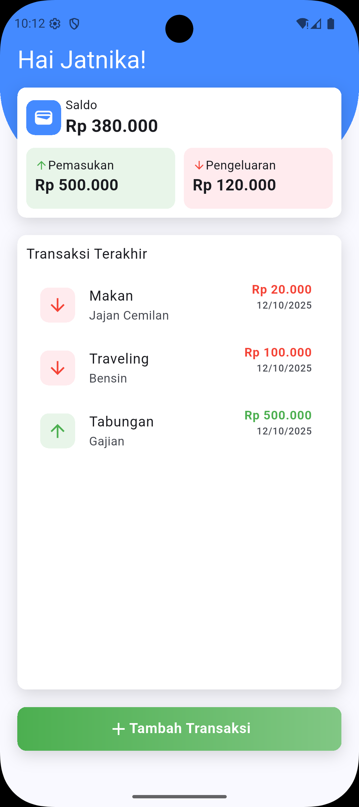

# [WEBINAR] Ngoding Online Bareng

<p align="center">
  
</p>

## 🧩 Prerequisite

Bagi yang ikut live coding saat webinar, pastikan kamu sudah menyiapkan hal-hal berikut:

- 🐦 **Flutter SDK & Android SDK**  
  Pastikan sudah terinstall dan bisa menjalankan project di **emulator** atau **real device**.
- 💻 **Text Editor**  
  Direkomendasikan menggunakan **Visual Studio Code (VS Code)**.
- 🔌 **Plugin VSCode yang diperlukan:**  
  - Flutter  
  - Pubspec Assist  
  - GetX Snippets  
  - Gemini Code Assist
- ⚙️ **Node.js (NPM)**  
  Pastikan Node.js sudah terinstall di sistem kamu.

## 🧾 Struktur Data

### 💰 Transaction Data
```json
{
  "id": "",
  "categoryID": "",
  "categoryName": "",
  "type": "",
  "amount": "",
  "createdAt": "2025-10-18 20:00:00"
}
```
### 💰 Category Data
```json
{
  "id": "",
  "name": "",
  "createdAt": "2025-10-18 20:00:00"
}
```